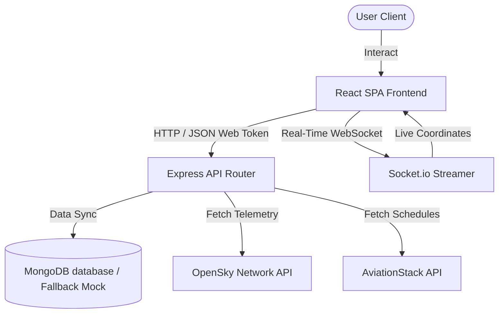

# ✈️ AeroLive

[](https://react.dev/)
[](https://nodejs.org/)
[](https://expressjs.com/)
[](https://www.mongodb.com/)
[](https://socket.io/)
[](https://tailwindcss.com/)
[](https://leafletjs.com/)

AeroLive is a high-performance, real-time aviation telemetry dashboard built on the MERN stack. Designed with a sleek, dark glassmorphism theme, it merges telemetry feeds from the OpenSky Network API and AviationStack schedules to track flights, manage cargo waybills, compare ticket pricing, and offer contextual AI flight assistance.

---

## 🎨 Premium UI/UX Polish

AeroLive features a custom-designed dashboard engineered for responsiveness and high visual appeal:
* **Frosted Glassmorphism Theme:** Set on a `#09090b` zinc-950 base with custom `.glass` cards, high backdrop blurs, and gradient-lit borders.
* **Floating Navbar Capsule:** A centered navigation pill with clean animated active capsules, micro-hover expansions, and automatic focus-blur routines.
* **Unified Glow States:** Animated neon color focus indicators (sky-blue, red, and violet) custom-mapped across all form input elements.
* **Telemetry Visualizations:** Dashed telemetry flight paths with SVG keyframe dash-array animations moving across dark-themed CartoDB map tiles.
* **Status Badges & Ripple Rings:** High-fidelity green satellite status dot with active outer CSS sonar radar pulsing rings.

---

## 🚀 Key Features

* **🛰️ Live Map Telemetry:** Interactive radar tracking map built with Leaflet. Click planes to view full statistics, route details, current altitude, squawk codes, and live tracking paths.
* **📉 Live Status Ticker:** Emergency announcement ticker showing hijacked or emergency squawking flights (7700/7600) with quick intercept/zoom functionality.
* **💳 Fare Comparison Suite:** Instant price comparison across key travel aggregators (MakeMyTrip, Air India, Goibibo, Ixigo, Skyscanner) with custom flight deal cards.
* **📦 Delhivery Cargo Tracker:** Real-time cargo waybill tracking including transit progress bars, parcel weight stats, transit milestones, and shipper information.
* **🤖 Integrated AeroAI Assistant:** Contextual Claude-driven chatbot capable of diagnosing current airborne stats, checking flight routes, and answering aviation queries.
* **🔒 Secured Authentication:** Account registration, JWT session verification, profile management, and Google OAuth support.

---

## 🏗️ Architecture



---

## ⚙️ Configuration & Environment

The backend server loads configuration details from a `.env` file located in the `/server` directory:

```env
PORT=5001
MONGO_URI=mongodb://127.0.0.1:27017/aerolive
JWT_SECRET=your_jwt_secret_key_here
CLIENT_URL=http://localhost:3000
```

> 💡 **MOCK MODE DATABASE:** If no local MongoDB service is active or `MONGO_URI` is left blank, the server automatically boots in **High-Performance Mock Mode** storing database items in temporary local memories so development can continue without blockages.

---

## 🛠️ Installation & Setup

Ensure you have [Node.js (version 20.x+)](https://nodejs.org/) installed on your machine.

### 1. Clone & Install Dependencies
Run the built-in installer script from the project root to install dependencies for the root, frontend, and backend packages:
```bash
npm run install:all
```

### 2. Startup Local Server
Run both the Express backend and React frontend concurrently in development mode:
```bash
npm run dev
```

The application will launch automatically at:
* **Frontend client:** `http://localhost:3000`
* **Backend API server:** `http://localhost:5001`

### 3. Production Build
To bundle the frontend application into optimized static assets for deployment:
```bash
npm run build
```

---

## 📁 Repository Structure

```
├── client/                 # React SPA Frontend
│   ├── public/             # Static HTML, Leaflet assets, and icons
│   └── src/
│       ├── components/     # UI, Map, Navbar, ChatBot & Cargo modules
│       ├── context/        # React Auth & Flight global states
│       └── services/       # Axios API integrations
├── server/                 # Node.js & Express Backend
│   ├── controllers/        # Flight & Cargo query orchestrators
│   ├── models/             # Mongoose MongoDB schemas
│   ├── routes/             # Authentication & data routes
│   └── index.js            # Express Entrypoint & WebSockets
├── package.json            # Concurrency and install scripts
└── render.yaml             # Render deployment configuration
```

---

## 📧 Support & Contact

For support, bug reporting, or features requests, contact the development lead:
* **Lead Developer:** Nikhil Kashyap
* **Email:** [kashyapnikhil585@gmail.com](mailto:kashyapnikhil585@gmail.com)
* **Phone:** +91 95308 50436
